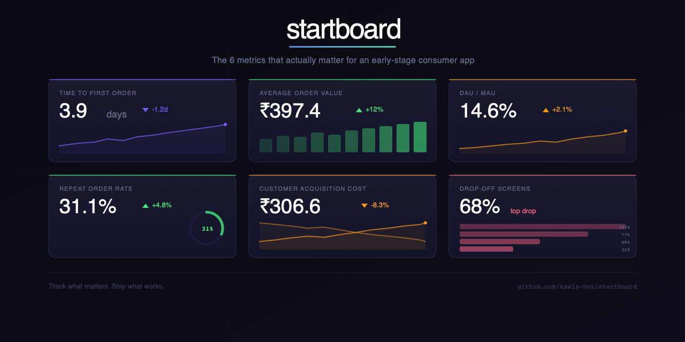

# startboard



> The 6 metrics that actually matter for an early-stage consumer app — in one screen, no noise.

Built because Mixpanel showed everything except what I needed to decide whether to keep building or pivot. Staring at dashboards full of events and funnels, what I actually needed was 6 numbers: how fast users convert, what they spend, whether they come back, where they drop off, whether they reorder, and what it costs to acquire them.

Startboard shows those 6 numbers. And lets you add more when you need them.

---

## What it shows

| Panel | What it tracks | Why it matters |
|---|---|---|
| **Time to First Order** | Avg days from signup to first purchase, trended | Your north star. Under 3 days = strong pull. Over 7 = friction. |
| **AOV** | Average order value with trend line | Rising AOV + rising orders = product-market fit signal |
| **DAU/MAU** | Engagement ratio, trended with raw DAU + MAU | Above 20% = healthy for a consumer app |
| **Repeat Order Rate** | % of users who order again within 60 days | Above 30% = genuine habit formation |
| **Customer Acquisition Cost** | Trended CAC with target benchmark | CAC should be less than 1/3 of LTV |
| **Drop-off Screens** | Ranked list of screens by drop-off %, colour coded | Fix the top 2 before building anything new |

Plus — add any metric from the library: Churn Rate, LTV, NPS, Refund Rate, Session Length, Orders per Day, and more. Or define your own.

---

## Features

- **6 core panels** preloaded with realistic demo data
- **Multi-select metric library** — select multiple metrics at once and add them all in one click
- **Compact view** — toggle between full chart view and condensed numbers-only mode
- **Drag to reorder** — rearrange panels by dragging them
- **Export** — download all metric data as JSON or CSV
- **Custom panels** — add blank panels with your own name, unit, target, and colour
- **Inline editing** — click Edit on any panel to update values directly
- **CSV data entry** — paste date,value rows to bulk-update any panel
- **Persistent** — all data saved in localStorage, survives page refresh
- **Tooltips** — every metric has a "what this means" insight built in
- **Colour-coded signals** — green/yellow/red vs your target, automatically

---

## Getting Started

```bash
git clone https://github.com/Aswin-Dot/startboard.git
cd startboard
npm install
npm run dev
```

Opens at `http://localhost:5173`

---

## Adding your own data

### Option 1 — Edit inline
Click **Edit** on any panel. Update values directly in the data textarea.

Format for trend panels:
```
Mar 1, 6.2
Mar 2, 5.9
Mar 3, 5.4
```

Format for drop-off panels:
```
Checkout → Payment, 68
Home → Product Detail, 41
Cart → Checkout, 18
```

### Option 2 — Add new metrics
Click **+ Add Metric** in the header. Select one or more metrics from the library, or choose "Custom Metric" to start blank. Demo data pre-fills so panels look complete immediately — edit them to replace with your real numbers.

---

## Tech Stack

- React 18
- Vite
- Recharts — area charts with reference lines
- localStorage — zero backend, zero auth
- Google Fonts — Syne + DM Mono

---

## Deploy

Hosted on GitHub Pages. Deploys automatically on push to `main`.

```bash
npm run build
# dist/ is deployed via GitHub Actions → GitHub Pages
```

**Live demo:** [aswin-dot.github.io/startboard](https://aswin-dot.github.io/startboard)

---

## Origin

This came out of running Pikvita — a hyperlocal grocery marketplace in Bangalore. We had Mixpanel, we had GA4, we had Appsflyer. And every Monday morning I'd open five tabs and spend 20 minutes piecing together the same 6 numbers to figure out if we were growing or dying.

Startboard is the dashboard I wish existed. One screen, the numbers that matter, no setup.

---

## License

MIT

---

*Built by [Aswin Raj](https://github.com/Aswin-Dot)*
